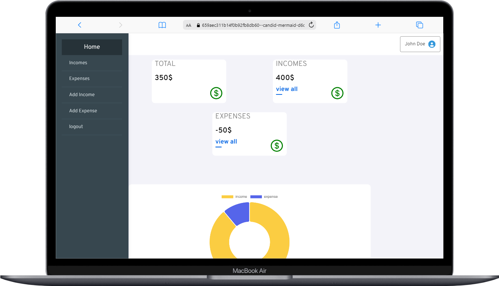

# Expense Tracker Application

This React-based Expense Tracker application is developed for managing personal finances.

## Features

- Expense Addition: Easily add expenses through the application.
- Income Addition: Record your income within the system.
- View Total Income and Expenses: Display total income and expense amounts on the homepage.
- Graphical Representation: Track income and expense amounts visually through graphical representation.

## Usage

1. **Expense Addition**
   - Add a new expense record from the "Add Expense" page.

2. **Income Addition**
   - Record a new income entry on the "Add Income" page.

3. **View Total Income and Expenses**
   - Display total income and expense amounts on the homepage.

4. **Graphical Representation**
   - Visually track income and expense amounts through graphical representation on the homepage.

### Screnshoots

